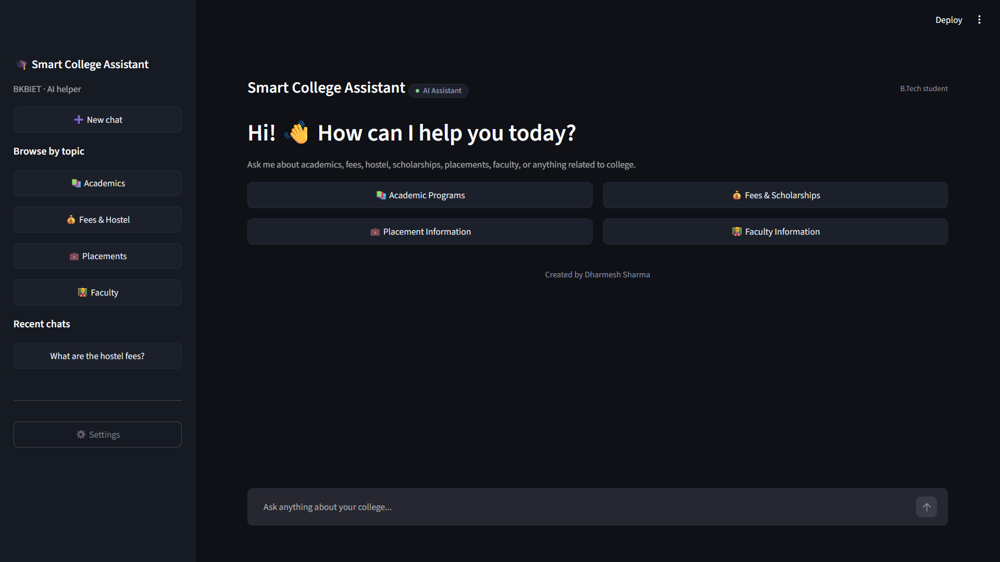

🎓 Smart College Chatbot

> An AI-powered college assistant built with **LangGraph, RAG, OpenAI, FAISS, FastAPI, and Streamlit** to provide intelligent answers about college academics, fees, placements, faculty, and other college-related information.

<p align="center">

<a href="http://smart-college-assistant-dharmeshsharma.streamlit.app/">
  
</a>

</p>

🔗 **Live Demo:**  
👉 http://smart-college-assistant-dharmeshsharma.streamlit.app/

---

## 📸 Application Preview



---

## 🧠 About the Project

**Smart College Chatbot** is an AI-powered conversational assistant designed to help students quickly access college-related information.

Instead of manually searching through multiple college documents, students can simply ask questions in natural language.

The chatbot uses a **LangGraph-based workflow** to classify the user's query and route it to the appropriate RAG knowledge base.

### Supported Knowledge Areas

- 📚 Academics
- 💰 Fees
- 🏠 Hostel
- 🎓 Scholarships
- 💼 Placements
- 🏢 Recruiters
- 👨‍🏫 Faculty
- 🏛️ Staff & Leadership
- 💬 General Questions

---

## ⚙️ How It Works

```text
                 👤 User
                    │
                    ▼
            💬 Streamlit UI
                    │
                    ▼
             LangGraph Workflow
                    │
                    ▼
             🔍 Query Classifier
                    │
          ┌─────────┼─────────┐
          │         │         │
          ▼         ▼         ▼
      Academic    Fees     Placement
        RAG        RAG        RAG
          │         │         │
          └─────────┼─────────┘
                    │
                    ▼
                Faculty RAG
                    │
                    ▼
             📚 FAISS Retrieval
                    │
                    ▼
              🤖 OpenAI LLM
                    │
                    ▼
             💡 Final Response
🚀 Key Features
🔀 Intelligent Query Routing

LangGraph classifies each query into:

academic
fees
placement
faculty
general

The query is then automatically routed to the appropriate workflow.

📚 RAG-Based Knowledge Retrieval

The chatbot retrieves information from college-specific PDF documents before generating answers.

Current knowledge bases include:

01_BKBIET_Academics.pdf
02_BKBIET_Fees_Hostel_Scholarships.pdf
03_BKBIET_Placements_Recruiters.pdf
04_BKBIET_Faculty_Staff_Leadership.pdf
🧠 Context-Aware Responses

The retrieved document chunks are provided to the LLM so that responses are based on the available college knowledge base rather than blindly generating information.

💬 Conversational UI

The application provides a clean Streamlit interface where students can:

Ask questions
Continue conversations
View chat history
Use predefined question categories
Retry responses
Clear conversations
🌐 FastAPI Backend

The project also includes a FastAPI backend that exposes the chatbot through an API endpoint.

Example:

POST /chat

Request:

{
  "message": "What courses are available?",
  "programme": "B.Tech"
}

Response:

{
  "response": "....",
  "query_type": "academic"
}
🏗️ Project Architecture
Smart College Chatbot
│
├── Streamlit Frontend
│       │
│       ▼
├── FastAPI Backend
│       │
│       ▼
├── LangGraph Workflow
│       │
│       ├── Query Classifier
│       │
│       ├── Academic RAG
│       │
│       ├── Fees RAG
│       │
│       ├── Placement RAG
│       │
│       ├── Faculty RAG
│       │
│       └── General Response
│
├── OpenAI LLM
│
├── OpenAI Embeddings
│
└── FAISS Vector Stores
        │
        └── College PDF Knowledge Base
🛠️ Tech Stack
Technology	Purpose
🐍 Python	Core programming language
🧠 LangGraph	Agent/workflow orchestration
🔗 LangChain	LLM and RAG integration
🤖 OpenAI	LLM + embeddings
🔎 FAISS	Vector similarity search
📄 PyPDF	PDF document loading
✂️ RecursiveCharacterTextSplitter	Document chunking
⚡ FastAPI	Backend API
🎨 Streamlit	Web interface
🐙 Git & GitHub	Version control
☁️ Streamlit Cloud	Deployment
📂 Project Structure
smart-college-assistant/
│
├── 📁 PDFs/
│   ├── 01_BKBIET_Academics.pdf
│   ├── 02_BKBIET_Fees_Hostel_Scholarships.pdf
│   ├── 03_BKBIET_Placements_Recruiters.pdf
│   └── 04_BKBIET_Faculty_Staff_Leadership.pdf
│
├── 📁 .streamlit/
│   └── config.toml
│
├── app.py
├── backend.py
├── project.py
├── requirements.txt
├── .gitignore
└── README.md
🔄 LangGraph Workflow

The workflow starts from the user query and follows a conditional routing architecture.

1️⃣ Start

The user submits a question through the Streamlit interface.

2️⃣ Query Classification

The classifier determines the category:

Academic
Fees
Placement
Faculty
General
3️⃣ Conditional Routing

LangGraph routes the query to the appropriate node.

START
  ↓
Classifier
  ↓
 ┌──────────────┬──────────────┬──────────────┬──────────────┐
 ↓              ↓              ↓              ↓
Academic       Fees        Placement       Faculty
 RAG            RAG            RAG            RAG
 └──────────────┴──────────────┴──────────────┴──────────────┘
                         ↓
                     Response
                         ↓
                        END
4️⃣ Retrieval

Relevant document chunks are retrieved from the corresponding college knowledge base using FAISS.

5️⃣ Response Generation

The retrieved context is passed to the OpenAI model to generate the final response.

🔐 Environment Variables

Create a .env file locally:

OPENAI_API_KEY=your_openai_api_key

⚠️ Never commit your .env file to GitHub.

For Streamlit Cloud deployment, add the API key through the application's Secrets configuration.

💻 Run Locally
1. Clone the repository
git clone https://github.com/dharmeshsharma8085/smart-college-assistant.git
2. Enter the project directory
cd smart-college-assistant
3. Create a virtual environment
python -m venv venv
4. Activate the environment
Windows
venv\Scripts\activate
5. Install dependencies
pip install -r requirements.txt
6. Configure environment variables

Create .env:

OPENAI_API_KEY=your_openai_api_key
7. Run the Streamlit application
streamlit run app.py

The application will open locally at:

http://localhost:8501
🌐 API

The project also provides a FastAPI backend.

Run:

uvicorn backend:api --reload

API documentation will be available through FastAPI's automatic documentation interface.

🎯 Future Improvements
 Persistent FAISS vector stores
 Better conversational memory
 Multi-program support
 Authentication
 Admin dashboard
 More college knowledge bases
 Source citations in responses
 Improved query classification
 Production API deployment
 Database-backed conversation history
👨‍💻 Developer
Dharmesh Sharma

B.Tech Artificial Intelligence
BKBIET Pilani

GitHub:
https://github.com/dharmeshsharma8085

🚀 Live Application
<p align="center"> <a href="http://smart-college-assistant-dharmeshsharma.streamlit.app/">

<strong>👉 Open Smart College Assistant</strong>

</a> </p>
⭐ Support

If you find this project useful, consider giving the repository a ⭐ on GitHub.


I used:

```markdown


